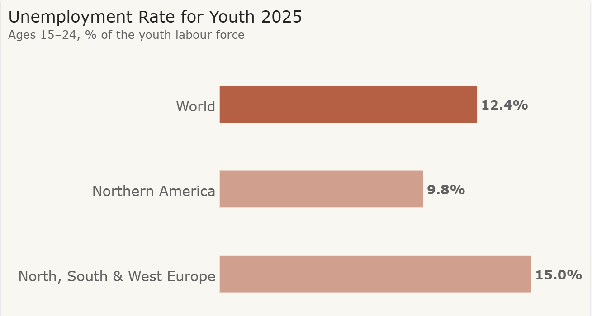

# Youth Unemployment | ILO 2026 Report

An exploration of youth unemployment using **2025 estimates published by the International Labour Organization (ILO) in August 2026**, with an Excel dataset and a Power BI Desktop project.

The project focuses on the challenges young people face when entering the labour market. **2025 in the repository name is the year measured; 2026 is the ILO report's publication year.**

## Chart preview



**Source:** [International Labour Organization, August 2026](https://www.ilo.org/resource/news/youth-unemployment-rises-young-people-face-harder-road-decent-work). Estimates for 2025. The chart label **North, South & West Europe** abbreviates **Northern, Southern and Western Europe**.

[Download the chart PNG](data/data-plot.png) · [Excel dataset](data/youth-unemployment.xlsx) · [LinkedIn post (Word)](docs/linkedin-post.docx)

## Project status

The final chart image, Excel dataset and editable Power BI Project (`.pbip`) are included. The `Dashboard` page contains one horizontal bar chart comparing all three observations and a card showing the worldwide unemployed youth count. The PNG exports the rate chart only; the count card is available in the editable report.

This is a static analysis of selected 2025 estimates. No public Power BI Service report is linked.

## Data snapshot

All rates below refer to people aged **15–24 in 2025**, measured as a share of the youth labour force.

| Region | Youth unemployment rate |
| --- | ---: |
| World | 12.4% |
| Northern America | 9.8% |
| Northern, Southern and Western Europe | 15.0% |

The ILO also reports approximately **67 million unemployed young people worldwide** in 2025. These figures come from the [ILO news release published on 11 August 2026](https://www.ilo.org/resource/news/youth-unemployment-rises-young-people-face-harder-road-decent-work).

## Dataset

Download [youth-unemployment.xlsx](data/youth-unemployment.xlsx). The workbook contains:

- `Data`: the three source observations in the named table `YouthUnemployment3` (`A1:E4`). Edit this sheet when updating the source data.
- `PivotSheet`: a supporting pivot view, not the report's import source.

The supplied Power BI query currently imports the entire `Data` worksheet and promotes its first row to headers. Keep this worksheet limited to the header and source records; place notes and totals elsewhere.

| Field | Data type | Meaning |
| --- | --- | --- |
| `Region` | Text | World total or selected geographic region |
| `Year` | Whole number | Reference year: 2025 |
| `AgeGroup` | Text | Age range: 15–24 |
| `UnemploymentRate` | Decimal number | Rate stored as a fraction: `0.124` represents `12.4%` |
| `UnemployedPeople` | Whole number, nullable | Rounded world count: `67000000`; regional counts are unavailable in the cited release |

The workbook is a manually transcribed, three-row extract from the ILO release, not a complete ILO database export. Blank counts mean unavailable, not zero.

## Open the Power BI project

1. Clone or download the **entire repository**. Keep the `.Report` and `.SemanticModel` folders alongside the `.pbip` file in `data`.
2. Open [youth-unemployment-dashboard.pbip](data/youth-unemployment-dashboard.pbip) in a compatible version of Power BI Desktop. See [Microsoft's Power BI Project documentation](https://learn.microsoft.com/en-us/power-bi/developer/projects/projects-overview) for requirements and preview settings.
3. Before refreshing on another computer, update the Excel source path. The `Data` Power Query currently uses the author's absolute local file path. In Power Query, edit the query's `Source` step so `File.Contents(...)` points to your local `data/youth-unemployment.xlsx`.
4. Apply the query changes and refresh to load the data. The local model cache is excluded from Git, so a fresh clone needs a successful refresh.
5. Open the `Dashboard` page to view or edit the visuals.

The `Data` query imports the `Data` worksheet, assigns column types, removes `Year` and `AgeGroup`, and adds `IdRegion` to preserve the region order. It shortens the European label to `North, South & West Europe`. Full region names, year and age group remain in Excel; all current observations refer to 2025 and ages 15–24.

## Methodology and limitations

- The unemployment rate uses the youth labour force as its denominator, not all people aged 15–24.
- The world total overlaps the regional observations. Do not add the world and regional counts or sum their unemployment rates.
- The European observation covers Northern, Southern and Western Europe. It is not an EU-only or all-Europe figure.
- The dataset compares selected regions for one year. It cannot show a time trend or establish the causes of unemployment.
- Youth unemployment does not directly measure employers' experience requirements or the outcomes of all first-time job applicants.
- The source contains rounded estimates. The workbook has no automatic refresh connection.
- The supplied bar chart uses `Sum` of `UnemploymentRate` within each region. This returns the supplied values only because the current dataset has one row per region. Revisit the aggregation and restore year/age fields in the model before adding observations.
- Selecting a regional bar can filter other visuals. Regional unemployed-person counts are blank, so the count card may become blank under a regional selection; clear the selection to return to the world total.

## Sources

- [ILO: Youth unemployment rises as young people face a harder road to decent work](https://www.ilo.org/resource/news/youth-unemployment-rises-young-people-face-harder-road-decent-work) — 11 August 2026; the direct source for all values in this dataset.
- [ILO: Global Employment Trends for Youth 2026: Back to the future](https://www.ilo.org/publications/major-publications/global-employment-trends-youth-2026) — the accompanying report and broader analysis.
- [ILOSTAT](https://ilostat.ilo.org/) — official labour statistics portal for further research.

## Repository contents

Read the [published LinkedIn post](https://www.linkedin.com/posts/thedatadisciple_you-need-experience-to-get-a-job-but-how-activity-7504525000364838915-5rXB) and join the discussion. The accompanying English text is also available as a [Word document](docs/linkedin-post.docx).

```text
README.md
LICENSE
LICENSE-CC-BY-4.0
THIRD_PARTY_NOTICES.md
.gitignore
docs/
  linkedin-post.docx
data/
  youth-unemployment.xlsx
  data-plot.png
  youth-unemployment-dashboard.pbip
  youth-unemployment-dashboard.Report/
  youth-unemployment-dashboard.SemanticModel/
```

The `.Report` folder holds page layouts, visuals and themes. The `.SemanticModel` folder holds the model and Power Query definition. `.gitignore` excludes Power BI's local settings, cached data and the unpublished `local-review` working copy.

## License and attribution

Copyright (c) 2026 Dmytro Klymchuk (TheDataDisciple), for original contributions to the extent copyright applies.

This project uses different licenses for different types of material. The presence of the root `LICENSE` file does not place all repository content under MIT.

| Material | License and scope |
| --- | --- |
| Original software and model logic, including Power Query M, any DAX, `.tmdl` model definitions, and project configuration | [MIT](LICENSE) |
| Original prose in `README.md` and `docs/linkedin-post.docx` | [CC BY 4.0](LICENSE-CC-BY-4.0), excluding quoted and third-party material |
| Original visual design, chart labels and narrative content in the Power BI report and `data/data-plot.png`, and original workbook presentation in `data/youth-unemployment.xlsx` | [CC BY 4.0](LICENSE-CC-BY-4.0), only to the extent of the author's rights |
| ILO data, the NLT Scripture quotation, and bundled Microsoft themes | Their respective third-party terms; see [THIRD_PARTY_NOTICES.md](THIRD_PARTY_NOTICES.md) |

For mixed report-definition files, MIT covers original software/configuration portions; CC BY 4.0 covers original expressive design and prose. Neither license grants rights to third-party components. Original source-code examples embedded in documentation remain under MIT.

CC BY 4.0 allows sharing and adaptation, including commercial use, with appropriate attribution, a license link and an indication of changes. Attribute original text and design to **Dmytro Klymchuk (TheDataDisciple)** and link to [this repository](https://github.com/TheDataDisciple/youth-unemployment2025). Attribute the statistical source separately to the **International Labour Organization**. The full license governs; this summary adds no restrictions.

Third-party exclusions apply wherever those materials appear, including inside DOCX, XLSX and report files. Carry the relevant notices with redistributed copies. No rights are claimed over facts or other material that is not subject to applicable copyright or database rights.

This clarification does not withdraw permissions already granted for earlier versions. This is an independent project and is not affiliated with or endorsed by the ILO, Tyndale or Microsoft.
